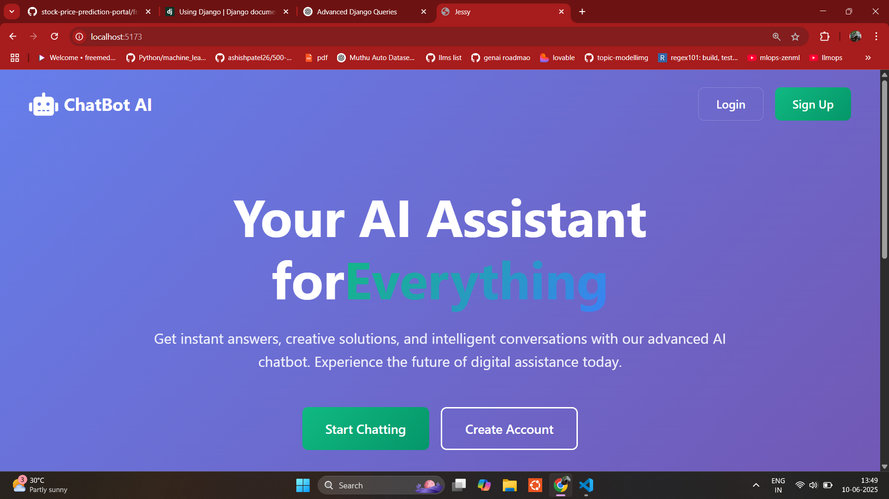
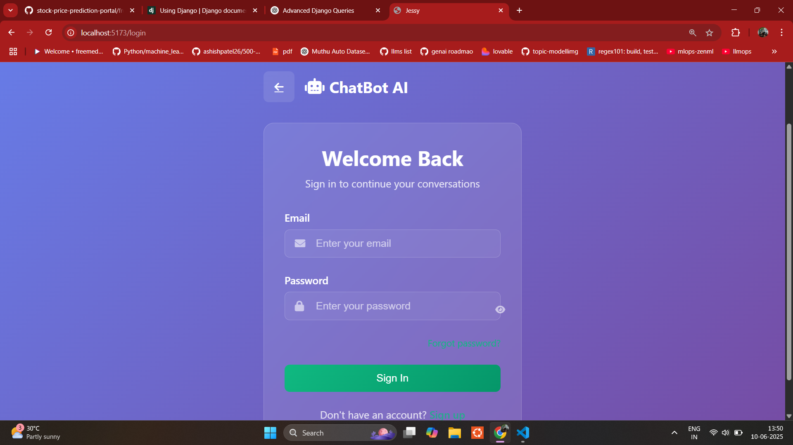
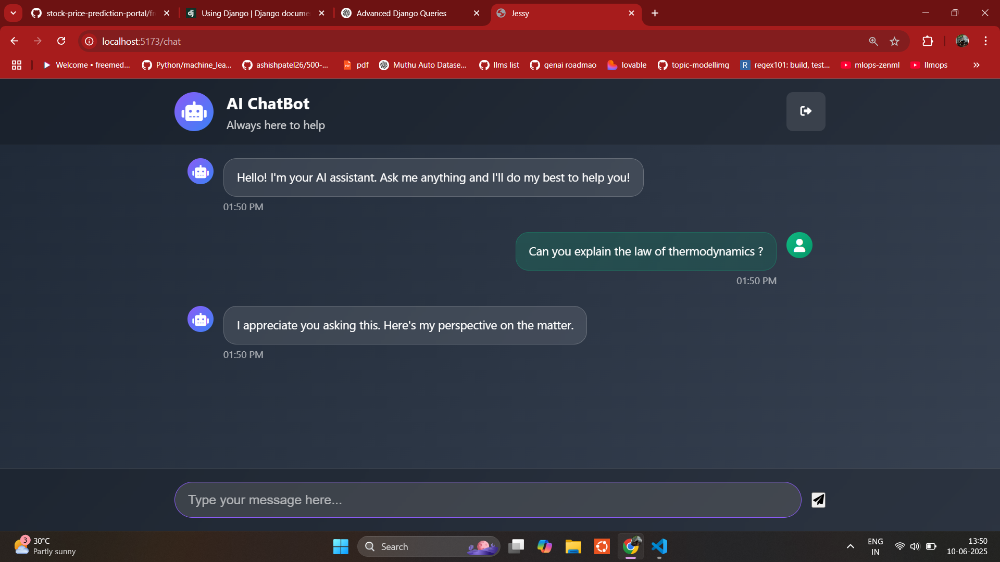

# GenAI ChatBot - React + Django

An intelligent chatbot web application built using **React (frontend)** and **Django (backend)**, integrated with **Generative AI** to provide natural, dynamic responses to user queries. Designed with modern UI/UX practices and real-time conversational flow.

---

## Screenshots

### Landing Page


### Login Interface


### Chat Interface


---
## Features

- 🌐 **Frontend in React**
  - Smooth SPA-style navigation
  - Responsive design with modern CSS
  - Real-time chat interface with typing indicator

- 🧠 **Backend in Django**
  - API endpoints using Django REST Framework (DRF)
  - Secure user authentication (optional)
  - Integration with OpenAI/HuggingFace or custom GenAI logic

- 🤖 **Generative AI Integration**
  - Contextual message handling
  - Smart fallback and keyword detection
  - Pluggable GenAI backend (OpenAI, LLaMA, etc.)

- 💬 **Chat Features**
  - AI typing simulation
  - Time-stamped messages
  - User and bot avatars

---
## Project Structure

```
GenAI-Question-Answering-Bot/
├── backend/
│ ├── chatbot/ # Django app with views, models, and AI logic
│ ├── genai_chatbot/ # Django project settings
│ └── requirements.txt
├── frontend/
│ ├── public/
│ ├── src/
│ │ ├── components/
│ │ ├── pages/
│ │ └── App.jsx
│ └── package.json
├── manage.py
└── README.md
```
## Installation

### Backend (Django)

```bash
cd backend
python3 -m venv venv
source venv/bin/activate
pip install -r requirements.txt
python manage.py migrate
python manage.py runserver
```

### Frontend (React)

```bash
cd frontend 
cd qa-chatbot
npm install
npm run dev   # or npm start
```


## Author
Febin C.F | febin.web3dev@gmail.com | [@febincf-mle](https://www.github.com/febincf-mle)
